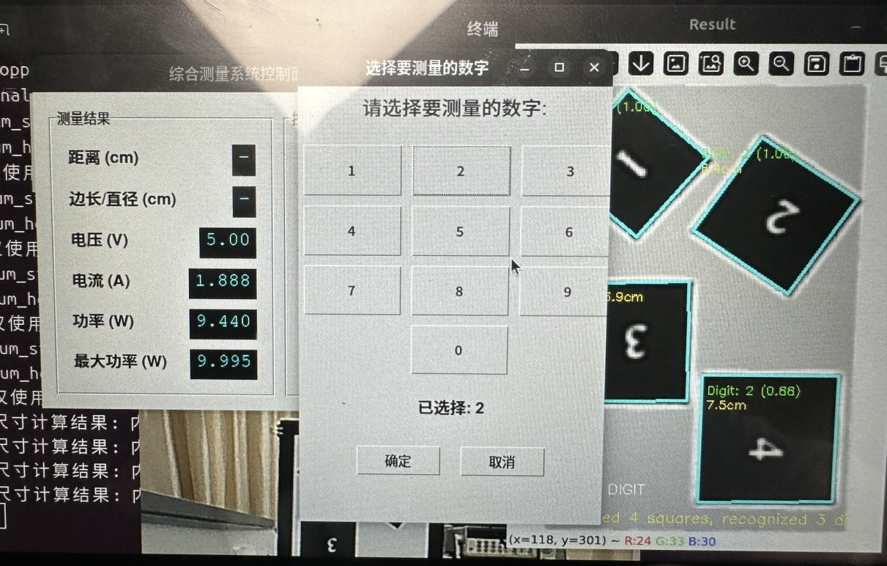
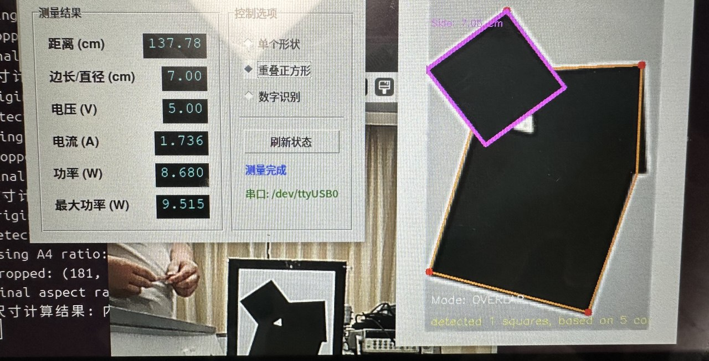
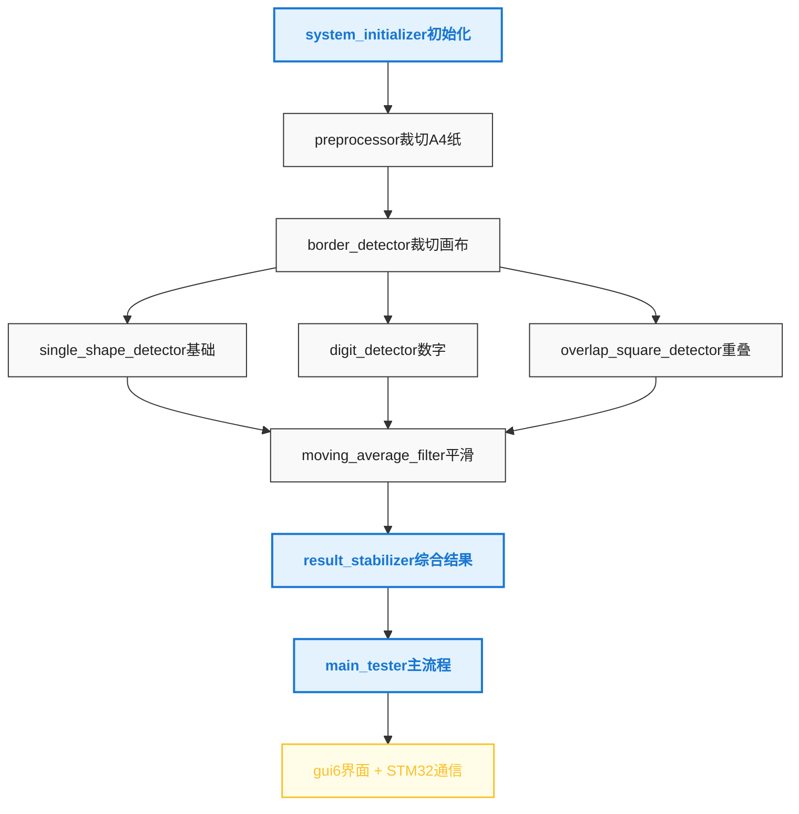
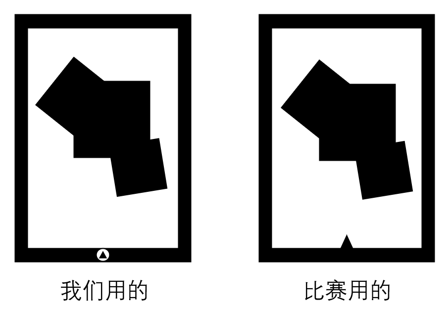

# 2025年大学生电子设计竞赛 C题：形状识别

**安徽省三等奖** | [题目详情](docs/2025年省赛题目.md)

## 快速开始

1. 配置 `system_initializer.py`：摄像头序号（默认0）、STM32端口号（可选）
2. 更新 `calib.yaml`（可选）

### 运行
```bash
# GUI版本（比赛要求）
python gui6.py

# 算法测试（CV2窗口）
python main_tester.py
```

## 功能展示

| 数字识别 | 旋转重叠识别 |
|---------|-------------|
|  |  |

## 系统架构



**核心算法**：
- **基本形状识别** - 多边形拟合，根据拟合点数分类（三角形/正方形/圆形）
- **旋转数字识别** - 角点排序→旋转裁切→4个方向极简CNN找mnist→置信度最高
- **重叠正方形分离** - L形角点连线→排除越界→生长正方形→筛选有效区域

## 赛后复盘

### 致命问题


黑色定位三角形画在黑边内框，破坏Canny边缘 → 无法solve PnP定位和测边长

### 技术教训
1. **Canny局限性** - 轮廓破坏和锯齿化不容忽视
2. **比赛策略** - 限时环境避免过度封装，用tkinter够用
3. **测试完备性** - 保留各模块测试代码到test/，实现debug image方法
4. **算法清晰度** - 能口述流程的算法debug更快
5. **常理vs AI** - 能用常理解释的算法质量可能更高，garbage in garbage out
6. **硬件准备** - 6-9寸HDMI屏幕需要负载更高的typec线

### 个人反思

**技术定位困惑**：
处于AI辅助和手写代码的尴尬交界 —— AI用户快速出结果，手写大佬清晰准确，我却不伦不类，既累又晕。

**比赛体验吐槽**：
- 队友第一天完工后：一个负责外卖，一个边帮忙边嘲讽
- 紧张+实验室噪音 = 脑浆糊状态  
- 住宿条件：硬床板+打呼噜舍友 → 70块单人房救命
- 三天雨天在洗脸池洗衣服用吹风机烘干...

> 神仙难救，神仙难救啊~
> 点个⭐安慰主播~